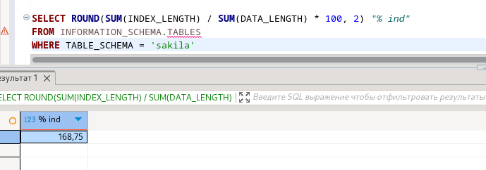
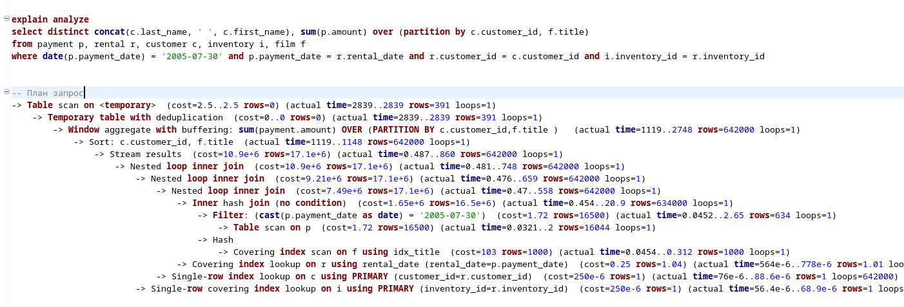
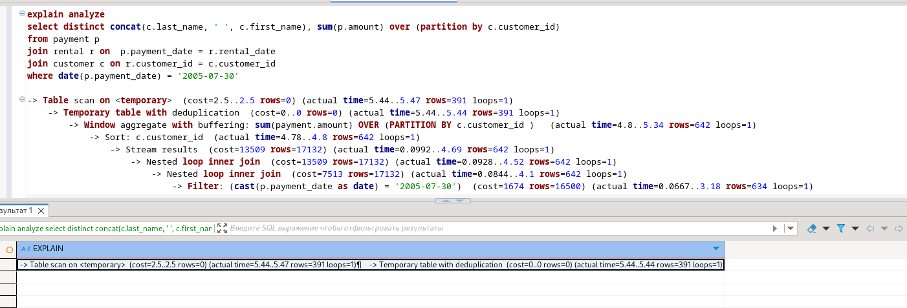
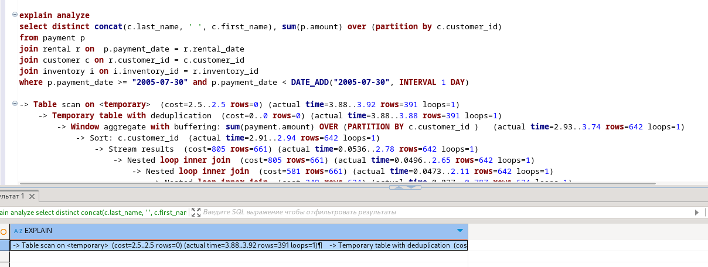

# Домашнее задание к занятию «Индексы» - Варфоломеева Марьяна


### Задание 1

Напишите запрос к учебной базе данных, который вернёт процентное отношение общего размера всех индексов к общему размеру всех таблиц.

### Решение
```sql
SELECT ROUND(SUM(INDEX_LENGTH) / SUM(DATA_LENGTH) * 100, 2) "% ind"
FROM INFORMATION_SCHEMA.TABLES
WHERE TABLE_SCHEMA = 'sakila'
```



### Задание 2

Выполните explain analyze следующего запроса:
```sql
select distinct concat(c.last_name, ' ', c.first_name), sum(p.amount) over (partition by c.customer_id, f.title)
from payment p, rental r, customer c, inventory i, film f
where date(p.payment_date) = '2005-07-30' and p.payment_date = r.rental_date and r.customer_id = c.customer_id and i.inventory_id = r.inventory_id
```
- перечислите узкие места;
- оптимизируйте запрос: внесите корректировки по использованию операторов, при необходимости добавьте индексы.

### Решение

Выполнен explain analyze запроса, время выполнения = 2839 мс



Для оптимизации в запросе удалены обращения к таблицам inventory и film 
Использован оператор join
Время выполнения = 5.47 мс

```sql
select distinct concat(c.last_name, ' ', c.first_name), sum(p.amount) over (partition by c.customer_id)
from payment p 
join rental r on  p.payment_date = r.rental_date
join customer c on r.customer_id = c.customer_id
where p.payment_date >= "2005-07-30" and p.payment_date < DATE_ADD("2005-07-30", INTERVAL 1 DAY) 
```



Также дополнительно создан индекс для поля payment.payment_date:
```sql
create index pay_date_idx USING BTREE  ON payment(payment_date);
```
Время выполнения = 4.83 мс




